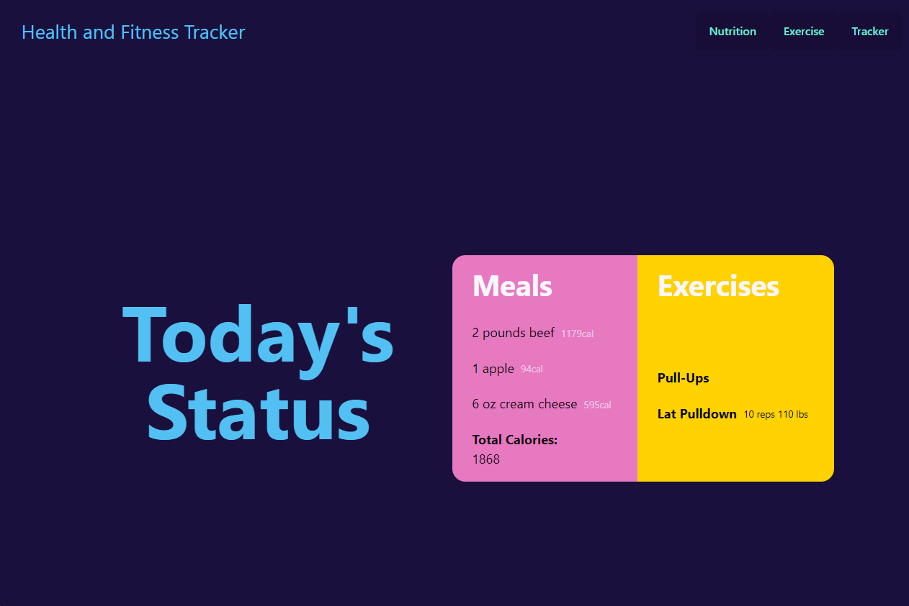
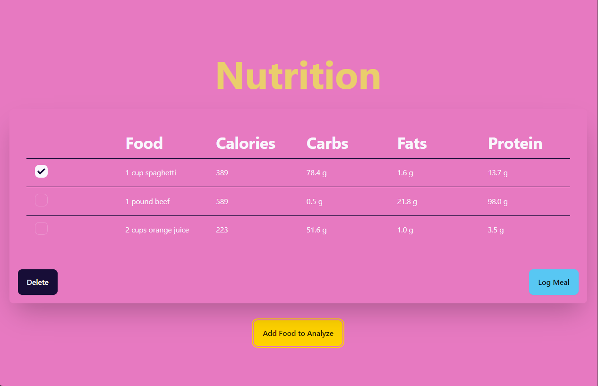
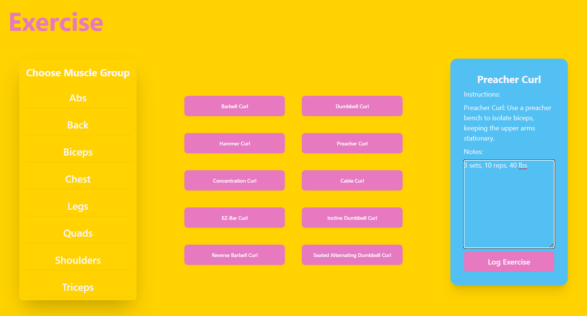

# Health and Fitness Tracker Project

## Purpose

This is a simple health and fitness tracking application that allows users to search for nutrition information and exercises, and log them on the app.

The app initially displays the user's logged meals and exercises. The user can click navigation links to go to the Meal and Nutrition trackers.

## Nutrition

On the Nutrition tracker, the user can click "Add Food to Analyze". A modal will appear in which the user can type in an amount and a food. When the user clicks "Analyze," the food's nutrition will be logged into the table. The user can use the checkboxes on the left side to select a row of food. The user can click the Delete button to delete any rows that are checked. The user can then log all food listed in the table to the daily status by clicking "Log Meal". The meal will be stored in local storage.

## Exercise

On the Exercise tracker, the user can choose a muscle group on the left side of the page. Upon choosing a muscle group, the center column will display 10 exercises for that muscle group to choose from. When the user clicks one of the exercises, the name and instructions for that exercise will be displayed on the right side of the page. The user can type in notes and log the exercise into the daily status by clicking "Log Exercise". The exercise will be stored in local storage.

## Screenshots

## Contact Team Quad

Feel free to reach out to Team Quad if you have any questions, suggestions, or collaboration opportunities.

- **Email**: ccbabb@gmail.com
- **GitHub**: https://github.com/pauldsherrill

## License

This project is licensed under the [MIT License](https://opensource.org/licenses/MIT).
